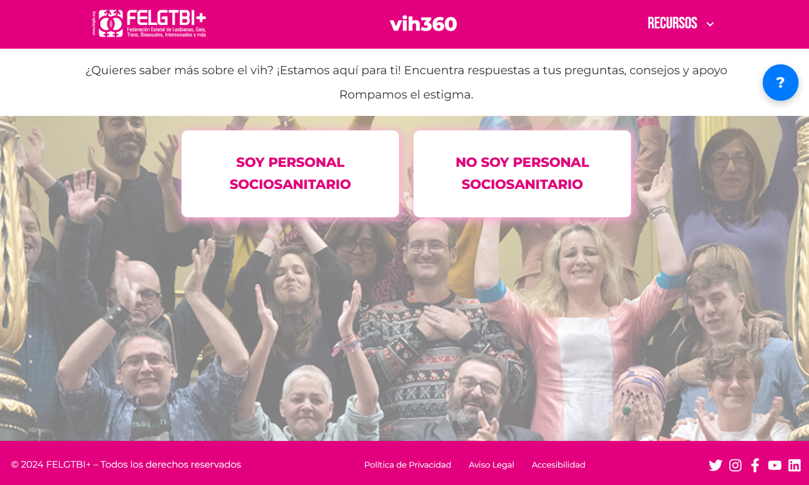
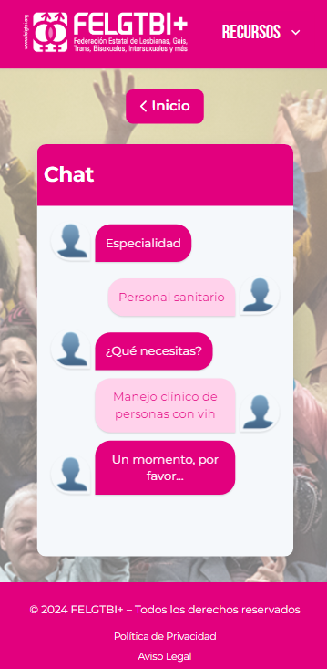
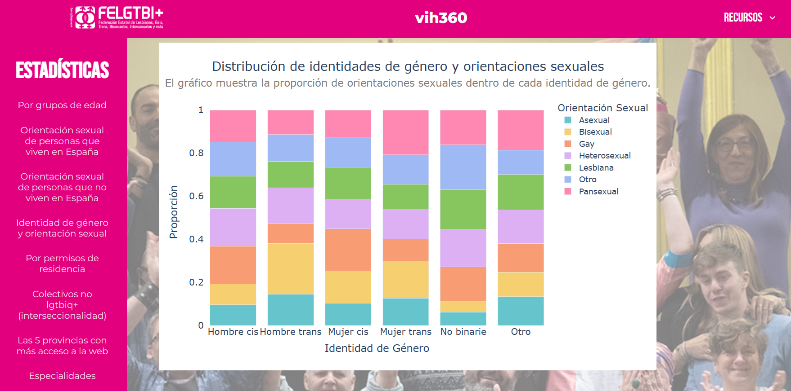
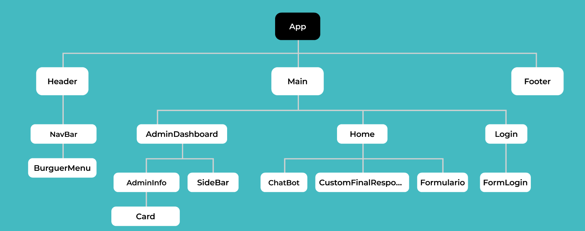

# Chatbot para FELGTBIQ

  

---

##  Briefing del proyecto 

 Crear  un  chat  bot  intuitivo  y  accesible  que  ofrezca  atención 
y  orientación  sobre  el  vih  con  el  objetivo  de  proporcionar 
información precisa, reducir el estigma y ofrecer apoyo.   
<strong>Dirigido a:</strong>  Personas  con  diagnóstico  de  vih  o  que  creen 
que  pueden  haber  contraído  vih.  También  para  personal 
sociosanitario  para  que  pueda  orientar  a  las  personas 
usuarias.
      

## 📝 ÍNDICE

- [Acerca de](#about)
- [Inclusión y accesibilidad](#inclusion)
- [Flujo de la aplicación](#flujo)
- [Herramientas utilizadas](#built_using)
- [Implementaciones futuras](#implementacionesf)
- [Autoría](#authors)

---

## Acerca del proyecto&#x20;

🌐 Impacto esperado: Este asistente no solo contribuirá a la sensibilización y educación sobre el vih, sino también a reducir el estigma asociado, brindando información útil a quienes la necesiten, desde personas diagnosticadas hasta profesionales sociosanitarios.

🔎 Enfoque: Una experiencia digital inclusiva, adaptada a todo tipo de dispositivos, con una interfaz intuitiva y una navegación amigable.

---

## Inclusión y accesibilidad&#x20;

- **Diseño accesible**: Garantizamos una experiencia adecuada para personas con diferentes niveles de alfabetización digital o capacidades.
- **Adaptabilidad**: Interfaz optimizada para smartphones, tablets y escritorios.
- **UI/UX intuitivo**: Diseño pensado para facilitar el uso desde el primer contacto.
- **Diseño corporativo**: Integrado con la identidad de FELGTBI+.
- **Integración de recursos clave**: Acceso directo a RRSS, sitios web oficiales y otros recursos esenciales.

---
## Flujo de la Aplicación

### Para la persona usuaria

1. **Formulario inicial**:  
   La persona usuaria completa un formulario con la información necesaria para su consulta.
   
2. **Envío a la base de datos**:  
   La información proporcionada en el formulario es almacenada en la base de datos para su posterior procesamiento.
   
3. **Interacción con el chatbot**:  
   La persona usuaria inicia una conversación con el chatbot, que analiza las consultas basándose en la información almacenada.
   
4. **Actualización en la base de datos**:  
   Después de la interacción con el chatbot, los datos se envían nuevamente a la base de datos para generar una respuesta personalizada utilizando inteligencia artificial.

5. **Respuesta personalizada**:  
   La base de datos devuelve una respuesta personalizada que se presenta al usuario a través del chatbot.

   

---

### Para la persona administradora

1. **Login para acceder al panel de administración**:  
   Admin accede a la aplicación ingresando sus credenciales de acceso.

2. **Acceso al Dashboard**:  
   Después del login, la ruta redirige al dashboard de administración.

3. **Visualización de datos**:  
   En el dashboard, admin puede ver gráficas que muestran los datos resultantes de las consultas de las personas usuarias.

4. **Datos anonimizados**:  
   Los datos presentados en el dashboard son anonimizados para garantizar la privacidad de las personas usuarias.

## ⚒️ Herramientas utilizadas&#x20;

### Tecnologías principales

- **React**: Desarrollo frontend moderno y dinámico.
- **Sass**: Estilos avanzados y personalizables.
- **GitHub**: Control de versiones y colaboración.
- **Trello**: Organización del flujo de trabajo.

### Paquetes y librerías

- **Vite**: Entorno de desarrollo rápido.
- **Axios**: Manejo eficiente de solicitudes HTTP.
- **Mui**: Componentes de interfaz atractivos y accesibles.
- **Uuid**: Generación de identificadores únicos.
- **Router dom**: Navegación fluida entre vistas.
- **React simple chatbot**: Implementación del bot de manera sencilla y efectiva.

### API y BBDD

- **Base de datos**: Desplegada en AWS.
- **PostgreSQL**: Gestión de la base de datos.
 

---

## Implementaciones futuras:&#x20;

### Mejoras previstas

- **Testing avanzado**: Incrementar la robustez y fiabilidad del sistema.
- **Documentación de código**: Uso de JSDoc para facilitar el mantenimiento y colaboración.
- **Aumentar la seguridad**: Mejoras en la gestión de datos sensibles.
- **Soporte multilingüe**: Ampliación de alcance global.

### Evolución del chatbot

- **Personalización avanzada**: Ajustes adaptados a las necesidades de FELGTBI+.
- **Interacción bidireccional**: Introducción de una caja de texto final para abrir diálogos.
- **Editor de contenidos**: Opciones para editar, crear y eliminar preguntas y respuestas según sea necesario.

---

## ✍️ Autoría&#x20;

Este proyecto ha sido desarrollado por un equipo de personas profesionales comprometidas con la inclusión y la innovación:

- **Rubén Castro** ([https://github.com/RubenC2](https://github.com/RubenC2))
- **A. Hans Orellana** ([https://github.com/AlvaroHansOrellana](https://github.com/AlvaroHansOrellana))
- **Deydre Alonso** ([https://github.com/Deydre](https://github.com/Deydre))

🌟 Nota: Este chatbot es solo un paso hacia la creación de un ecosistema digital más inclusivo y accesible. Somos personas comprometidas con la mejora continua y abiertas a colaboraciones que amplifiquen su impacto.

